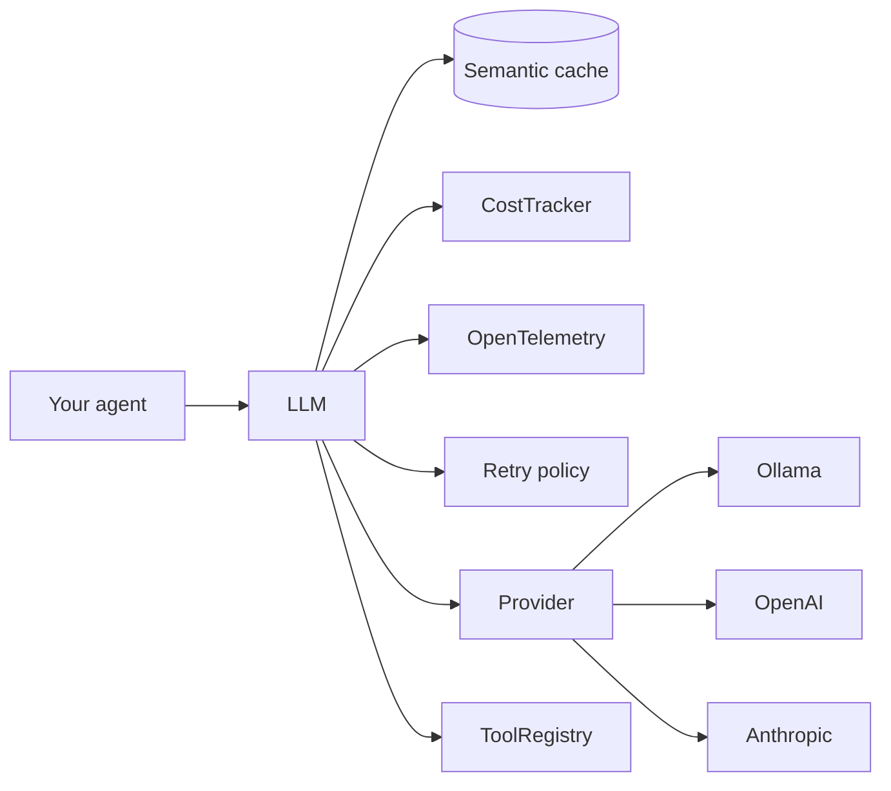

# agentic-kit

[](https://pypi.org/project/agentic-kit/)
[](LICENSE)


> **The unified LLM gateway for the Open Intelligence Labs ecosystem.** One async API for Ollama, OpenAI, Anthropic, Gemini, Groq, and Mistral — plus cost tracking, OpenTelemetry tracing, semantic caching, streaming tool calls, partial-JSON streaming, structured output, retry, and fallback. Local-first, Ollama-default.

⭐ **Star this repo** if it saves you from writing another LLM wrapper.

## Why

Every agent project ends up re-writing the same plumbing: provider abstractions, retries, cost math, tracing, caching, tool-calling loops. `agentic-kit` is that layer, extracted from production use in the Open Intelligence Labs projects (DeepDive, MeetMind, SecondBrain, BuildShip) so you don't have to write it again.

**Unopinionated primitives, not a framework.** No hidden magic, no giant DAGs, no global state. Compose what you need; delete what you don't.

## Install

```bash
pip install agentic-kit                          # core + Ollama (local) + Gemini (httpx)
pip install 'agentic-kit[openai,anthropic]'      # OpenAI & Anthropic SDKs
pip install 'agentic-kit[groq,mistral]'          # OpenAI-compatible providers
pip install 'agentic-kit[cache]'                 # sqlite-vec semantic cache
pip install 'agentic-kit[all]'                   # everything
ollama pull llama3.2                             # default local model
```

## 30-second tour

```python
import asyncio
from agentic_kit import LLM

async def main():
    llm = LLM()  # defaults to Ollama at localhost:11434
    r = await llm.complete("One sentence on why local-first AI matters.")
    print(r.content, "|", r.usage.total_tokens, "tokens |", f"${r.cost_usd}")

asyncio.run(main())
```

Swap providers with one env var:

```bash
export AGENTIC_KIT_PROVIDER=anthropic
export AGENTIC_KIT_MODEL=claude-haiku-4-5-20251001
export AGENTIC_KIT_API_KEY=sk-ant-...
```

## What's in the box

| Capability | What it does |
|---|---|
| **Unified client** | `LLM` — one async API for Ollama, OpenAI, Anthropic, Gemini, Groq, Mistral. |
| **Cost tracking** | `CostTracker` aggregates `cost_usd` per request, per model, per tag. |
| **Tracing** | Every call wrapped in an OpenTelemetry span with usage attributes. |
| **Exact-match cache** | `InMemoryCache` with TTL for deterministic prompts. |
| **Semantic cache** | `SqliteVecCache` — cosine-similarity hits via sqlite-vec. |
| **Tool calling** | `ToolRegistry` + `LLM.run_agent()` — unified tool calls across all providers. |
| **Streaming tool calls** | `LLM.stream_events()` / `run_agent_stream()` — typed deltas for text + tool calls. |
| **Structured output** | `LLM.extract(prompt, PydanticModel)` — JSON with self-repair. |
| **Partial-JSON streaming** | `LLM.extract_stream()` — progressive pydantic objects as they arrive. |
| **Retry** | `RetryPolicy` — exponential backoff with jitter. |
| **Fallback** | `FallbackProvider` — chain providers: Ollama → cloud. |
| **Local-first** | Ollama is the default. No API key required. |
| **Async everywhere** | Every I/O path is `async` / `await`. |
| **Zero telemetry** | No phone-home. Ever. |

## Cookbook

### Track cost per phase of an agent

```python
from agentic_kit import LLM, CostTracker

tracker = CostTracker()
llm = LLM(cost_tracker=tracker)
await llm.complete("plan: ...", tag="plan")
await llm.complete("summarize: ...", tag="summarize")
print(tracker.snapshot())
# {'total_usd': ..., 'by_tag': {'plan': ..., 'summarize': ...}, ...}
```

### Run an agent with tools

```python
from agentic_kit import LLM, ToolRegistry

tools = ToolRegistry()
tools.register_function(
    "add", "Add two numbers.",
    lambda a, b: a + b,
    input_schema={"type": "object", "properties": {
        "a": {"type": "number"}, "b": {"type": "number"}
    }, "required": ["a", "b"]},
)

llm = LLM(model="llama3.1")  # use a model with tool support
result = await llm.run_agent("what is 17 + 25?", tools=tools)
print(result.content)  # "17 + 25 equals 42."
```

### Extract structured data

```python
from pydantic import BaseModel
from agentic_kit import LLM

class Issue(BaseModel):
    title: str
    severity: str
    components: list[str]

issue = await LLM().extract("Bug: checkout crashes on 0% coupon...", Issue)
print(issue.severity)
```

### Semantic cache (local, free)

```python
from agentic_kit import LLM
from agentic_kit.cache.embeddings import OllamaEmbedder
from agentic_kit.cache.semantic import SqliteVecCache

cache = SqliteVecCache(
    path="cache.db",
    embedder=OllamaEmbedder(model="nomic-embed-text"),
    similarity_threshold=0.15,
)
llm = LLM(cache=cache)
await llm.complete("What is the capital of France?")      # miss → hits Ollama
await llm.complete("France capital — what is it?")         # hit, no LLM call
```

### Local-first with cloud fallback

```python
from agentic_kit import LLM, FallbackProvider, OllamaProvider, RetryPolicy
from agentic_kit.llm.openai_provider import OpenAIProvider

llm = LLM(
    provider=FallbackProvider([
        (OllamaProvider(), "llama3.2"),
        (OpenAIProvider(), "gpt-4o-mini"),
    ]),
    retry_policy=RetryPolicy(max_attempts=3),
)
```

## Configuration

All settings read from env, prefix `AGENTIC_KIT_`:

| Variable | Default |
|---|---|
| `AGENTIC_KIT_PROVIDER` | `ollama` |
| `AGENTIC_KIT_MODEL` | `llama3.2` |
| `AGENTIC_KIT_BASE_URL` | `http://localhost:11434` |
| `AGENTIC_KIT_API_KEY` | *(unset)* |
| `AGENTIC_KIT_TEMPERATURE` | `0.7` |

## Architecture



## Principles

- **Local-first.** Ollama is default; everything works offline.
- **Zero telemetry.** No analytics, no phone-home.
- **Async-only.** Every I/O path is `async` / `await`.
- **Typed.** Full type hints, pydantic for all data.
- **Composable primitives.** No mandatory DAG, no global state.

## Roadmap

- [x] Ollama, OpenAI, Anthropic, Gemini, Groq, Mistral providers
- [x] Cost tracking + versioned pricing table
- [x] OpenTelemetry tracing
- [x] In-memory + SQLite-vec semantic cache
- [x] Tool registry + agent loop (`LLM.run_agent`)
- [x] Streaming agent loop (`LLM.run_agent_stream`) with typed deltas
- [x] Structured output (`LLM.extract`) + partial-JSON streaming (`LLM.extract_stream`)
- [x] Retry / exponential backoff
- [x] Multi-provider fallback
- [ ] MCP (Model Context Protocol) server/client
- [ ] Vision / multimodal inputs across providers
- [ ] Cerebras / SambaNova / DeepSeek providers

## Contributing

See [CONTRIBUTING.md](CONTRIBUTING.md). Join us on [Discord](https://discord.gg/openintelligence-labs).

## Part of the Open Intelligence Labs ecosystem

`agentic-kit` powers every project in the [Open Intelligence Labs](https://github.com/openintelligence-labs) family — open source AI tools that replace expensive SaaS:

- [DeepDive](https://github.com/openintelligence-labs/deepdive) — deep research agent (replaces Perplexity Pro)
- [MeetMind](https://github.com/openintelligence-labs/meetmind) — meeting assistant (replaces Otter.ai)
- [BuildShip](https://github.com/openintelligence-labs/buildship) — AI app builder (replaces Lovable / v0)
- [SecondBrain](https://github.com/openintelligence-labs/secondbrain) — personal memory (replaces Rewind.ai)

## License

MIT
